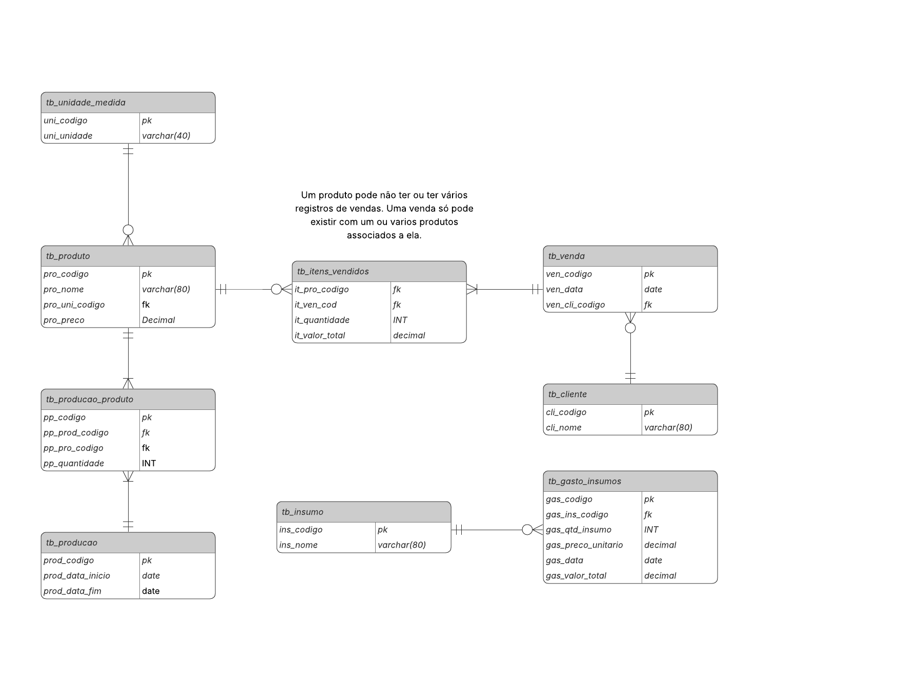

# DOCUMENTAÇÃO

Este projeto de banco de dados tem como tema o gerenciamento de uma empresa familiar rural. Seu foco é em **controle de insumos, gastos e de produção**, **registro de vendas, produtos e clientes**  

## SUMÁRIO

1. [Contexto do banco de dados](#1-contexto-do-banco-de-dados)
2. [Modelo Logico](#2-modelo-lógico-do-banco-de-dados)
3. [Dicionário de dados](#3-dicionário-de-dados)
4. [Consultas SQL](#4-consultas-sql)

--- 

## 1. Contexto do Banco de dados:
- **Qual problema o banco de dados resolve?**
    - Resolve a falta de controle e organização das informações operacionais e financeiras de uma empresa familiar rural.
- **Qual o contexto do sistema (ex.: clínica, loja, escola, campeonato etc.)?**
    - O sistema está inserido no contexto de uma empresa familiar rural, que realiza atividades de produção de produtos.

- **Quem seriam os usuários do sistema?**
    - Proprietário da empresa
- **Que tipo de informação o banco armazena e por quê?** 
    1. Produtos e unidades de medida, para padronizar produção e vendas
    2. Clientes e vendas, permitindo registrar o histórico comercial
    3. Itens vendidos, detalhando quantidade e valor de cada produto por venda
    4. Produções e produtos produzidos, para acompanhar períodos produtivos e volumes gerados
    5. Insumos e gastos com insumos, possibilitando o controle de custos e análise financeira
    > Essas informações são armazenadas para garantir organização, rastreabilidade e controle financeiro, além de facilitar relatórios e análises futuras.

---

## 2. Modelo Lógico do Banco de Dados:




---

## 3. Dicionário de dados:

#### tb_unidade_medida
Descrição: Armazena as unidades de medida utilizadas para os produtos (ex.: KG, UNI, etc.).

| Campo       | Tipo        | Null | Key | Default | Extra          |  Descrição    |
| :--         | :--         | :--  | :-- | :--      | :--           | :--           |
| uni_codigo  | int         | NO   | PRI | NULL    | auto_increment | Chave primária              |
| uni_unidade | varchar(40) | NO   |     | NULL    |                | Informar o nome da unidade de medida             |


#### tb_produto
Descrição: Armazena os produtos fabricados pela empresa \
Chaves estrangeiras: `pro_uni_codigo`

| Campo       | Tipo        | Null | Key | Default | Extra          | Descrição    |
| :--         | :--         | :--  | :-- | :--      | :-- |      :--
| pro_codigo     | int           | NO   | PRI | NULL    | auto_increment | Chave primária
| pro_nome       | varchar(80)   | NO   |     | NULL    |                | Informar o nome do produto
| pro_uni_codigo | int           | NO   | MUL | NULL    |                | Informar código correpondente a unidade de medida do produto
| pro_preco      | decimal(10,2) | NO   |     | NULL    |                | Informar o preço unitário do produto

#### tb_itens_vendidos
Descrição: Armazena os itens vendidos em cada venda, relacionando produtos às vendas realizadas, bem como a quantidade e o valor total de cada item. \
Chave Primária Composta: (`it_pro_codigo`, `it_ven_codigo`) 


| Campo       | Tipo        | Null | Key | Default | Extra          | Descrição
| :--         | :--         | :--  | :-- | :--      | :-- | :--
| it_pro_codigo  | int           | NO   | PRI | NULL    |       | Chave estrangeira (código do produto) correspondente ao produto a ser vendido
| it_ven_codigo  | int           | NO   | PRI | NULL    |       | Chave estrangeira (código da venda) correspondente a venda a ser realizada
| it_quantidade  | int           | NO   |     | NULL    |       | Informar a quantidade de produto.
| it_valor_total | decimal(10,2) | NO   |     | NULL    |       | Informar valor total da venda


#### tb_venda

Descrição: Armazena as vendas realizadas pela empresa, registrando a data da venda e o cliente associado. \
Chaves estrangeiras: `ven_cli_codigo`


| Campo       | Tipo        | Null | Key | Default | Extra          | Descrição
| :--         | :--         | :--  | :-- | :--      | :-- | :--
| ven_codigo     | int  | NO   | PRI | NULL    | auto_increment | Chave primária
| ven_data       | date | NO   |     | NULL    |                | Informar data da venda
| ven_cli_codigo | int  | NO   | MUL | NULL    |                | Chave estrangeira (código do cliente) correspondente ao cliente que realizou a compra

#### tb_cliente

Descrição: Armazena os clientes da empresa

| Campo       | Tipo        | Null | Key | Default | Extra          | Descrição
| :--         | :--         | :--  | :-- | :--      | :-- | :--
| cli_codigo | int         | NO   | PRI | NULL    | auto_increment | Chave primária
| cli_nome   | varchar(80) | NO   |     | NULL    |                | Informar o nome do cliente


#### tb_producao

Descrição: Armazena os períodos de produção da empresa, informando a data de início e a data de término de cada produção.


| Campo       | Tipo        | Null | Key | Default | Extra          | Descrição
| :--         | :--         | :--  | :-- | :--      | :-- | :--
| prod_codigo      | int  | NO   | PRI | NULL    | auto_increment | Chave primária
| prod_data_inicio | date | NO   |     | NULL    |                | Informar data de inicio da produção
| prod_data_fim    | date | NO   |     | NULL    |                | Informar data final da produção


#### tb_producao_produto

Descrição: Armazena os produtos associados a uma produção, informando a quantidade produzida de cada produto em determinado período produtivo.\
Chaves estrangeiras: `pp_pro_codigo`, `pp_prod_codigo`

| Campo       | Tipo        | Null | Key | Default | Extra          | Descrição
| :--         | :--         | :--  | :-- | :--      | :-- | :--
| pp_codigo      | int  | NO   | PRI | NULL    | auto_increment | Chave primária
| pp_prod_codigo | int  | NO   | MUL | NULL    |                | Chave estrangeira (código da produção) correspondente ao intervalo de produção
| pp_pro_codigo  | int  | NO   | MUL | NULL    |                | Chave estrangeira (código do produto) correspondente ao produto a ser produzido
| pp_quantidade  | int  | NO   |     | NULL    |                | Informar a quantidade de produto que foi produzido.


#### tb_insumo

Descrição: Armazena os insumos necessários para o funcionamento da empresa

| Campo       | Tipo        | Null | Key | Default | Extra          | Descrição
| :--         | :--         | :--  | :-- | :--      | :-- | :--
| ins_codigo | int         | NO   | PRI | NULL    | auto_increment | Chave primária
| ins_nome   | varchar(50) | NO   |     | NULL    |                | Informar nome do insumo

#### tb_gasto_insumos

Descrição: Armazena os gastos relacionados à compra de insumos, informando quantidade, valor unitário, valor total e data da aquisição. \
Chaves estrangeiras: `gas_ins_codigo`

| Campo       | Tipo        | Null | Key | Default | Extra          | Descrição
| :--         | :--         | :--  | :-- | :--      | :-- | :--
| gas_codigo         | int           | NO   | PRI | NULL    | auto_increment | Chave primária
| gas_ins_codigo     | int           | NO   | MUL | NULL    |                | Chave estrangeira |(codigo do insumo) correspondente ao insumo 
| gas_qtd_insumo     | int           | NO   |     | NULL    |                | Informar a quantidade de insumo
| gas_preco_unitario | decimal(10,2) | NO   |     | NULL    |                | Informar o preço unitario do insumo
| gas_data           | date          | NO   |     | NULL    |                | Informar a data da aquisição do insumo
| gas_valor_total    | decimal(10,2) | NO   |     | NULL    |                | Informar valor total da despesa

## 4. Consultas SQL

1. Quais clientes realizaram compras e qual o total comprado?

```sql
    SELECT cli_nome, SUM(it_valor_total) AS total_vendido
    -> FROM tb_cliente AS cli 
        -> INNER JOIN tb_venda AS ven ON cli.cli_codigo=ven.ven_cli_codigo
        -> INNER JOIN tb_itens_vendidos AS it ON ven.ven_codigo=it.it_ven_codigo
    -> GROUP BY cli.cli_nome 
    -> ORDER BY total_vendido;
```
**Saída:**    
  
| cli_nome | total_vendido |
| :-- | :-- |
| Antonio  |        500.00 |
| Fernanda |        700.00 |
    
 
**Descrição:** A consulta retorna os clientes que efetuaram compras, somando o valor total vendido para cada cliente e ordenando os resultados pelo total vendido.

2. Quantas compras cada cliente realizou na empresa?

```sql
     SELECT cli_nome, COUNT(ven_codigo) AS qtd_compras 
    -> FROM tb_cliente AS cli 
    -> LEFT JOIN tb_venda AS ven ON cli.cli_codigo=ven.ven_cli_codigo 
    -> GROUP BY cli.cli_nome ORDER BY qtd_compras ASC;
```

**Saída:**

| cli_nome | qtd_compras |
| :-- | :-- |
| Pedro    |           0 |
| Antonio  |           1 |
| Fernanda |           2 |


**Descrição**: A consulta mostra a quantidade de compras realizadas por cada cliente que possui, ou não, vendas registradas, ordenando da menor para a maior quantidade.


3. Quantos produtos foram vendidos pela empresa?

```sql 
    SELECT pro_nome, SUM(it_quantidade) AS total_produtos_vendidos
    -> FROM tb_produto AS pro
    -> INNER JOIN tb_itens_vendidos AS item ON pro.pro_codigo=item.it_pro_codigo
    -> GROUP BY pro.pro_nome
    -> ORDER BY total_produtos_vendidos;
```
**Saída:**

| pro_nome | total_produtos_vendidos |
| :-- | :-- |
| Goma     |                       5 |
| Farinha  |                      14 |


**Descrição**: A consulta retorna a quantidade total vendida de cada produto, somando as quantidades dos itens vendidos.

4. Qual foi a receita total gerada por cada produto vendido?

```sql
    SELECT pro_nome, SUM(it_quantidade) AS qtd_produtos_vendidos, SUM(it_valor_total) AS receita 
    -> FROM tb_produto AS pro  
    -> LEFT JOIN tb_itens_vendidos AS item ON pro.pro_codigo=item.it_pro_codigo 
    -> GROUP BY pro.pro_nome ORDER BY receita DESC;
```

**Saída:**

| pro_nome | qtd_produtos_vendidos | receita |
| :-- | :-- | :-- |
| Farinha  |                    14 |  700.00 |
| Goma     |                     5 |  500.00 |


**Descrição:** A consulta retorna a quantidade total vendida e a receita gerada por cada produto, ordenando do produto mais vendido até o menos vendido.


5. Qual a quantidade total produzida de cada produto?

```sql
    SELECT pro_nome, SUM(pp_quantidade) AS qtd_total_produzida 
    -> FROM tb_produto AS pro
    -> LEFT JOIN tb_producao_produto AS pro_produzido ON pro.pro_codigo=pro_produzido.pp_pro_codigo
    -> GROUP BY pro.pro_nome 
    -> ORDER BY qtd_total_produzida DESC;
```

**Saída:**

| pro_nome | qtd_total_produzida |
| :--  | :-- |
| Goma     |                5100 |
| Farinha  |                  80 |


**Descrição:** A consulta retorna a quantidade total produzida de cada produto, considerando os registros de produção.

6. Qual foi o valor total gasto com insumos pela empresa?

```sql
     SELECT SUM(gas_valor_total) AS total_gasto_insumos
    -> FROM tb_gasto_insumos;
```
**Saída:**

| total_gasto_insumos |
| :-- | 
|             8000.00 |


**Descrição:** A consulta calcula o valor total gasto com todos os insumos utilizados na produção.

7. Quais clientes compraram mais de 2 unidades de produtos no total?

```sql
     SELECT cli_nome, SUM(it_quantidade) AS qtd_produto, SUM(it_valor_total) AS total_compras     
    -> FROM tb_cliente AS cli     
    -> LEFT JOIN tb_venda AS ven ON cli.cli_codigo=ven.ven_cli_codigo    
    -> LEFT JOIN tb_itens_vendidos AS it ON ven.ven_codigo=it.it_ven_codigo 
    -> GROUP BY cli.cli_nome 
    -> HAVING qtd_produto>2;
```
**Saída:**

| cli_nome | qtd_produto | total_compras |
| :-- | :-- | :-- |
| Antonio  |          10 |        500.00 |
| Fernanda |           9 |        700.00 |


**Descrição:** A consulta identifica os clientes cujo total de produtos comprados é superior a 2 unidades, exibindo também o valor total gasto por eles.

8. Qual o menor, maior, total e valor médio das compras realizadas por cada cliente?


```sql 
    SELECT cli_nome, MIN(it_valor_total) AS menor_preco_compra, MAX(it_valor_total) AS maior_preco_compra, SUM(it_valor_total) AS total_compra, AVG(it_valor_total) AS media_compra  
    -> FROM tb_cliente AS cli 
    -> LEFT JOIN tb_venda AS ven ON cli.cli_codigo=ven.ven_cli_codigo 
    -> LEFT JOIN tb_itens_vendidos AS it ON ven.ven_codigo=it.it_ven_codigo 
    -> GROUP BY cli.cli_nome 
    -> ORDER BY maior_preco_compra DESC;
```

**Saída:**

| cli_nome | menor_preco_compra | maior_preco_compra | total_compra | media_compra |
| :-- | :-- | :-- | :-- | :-- |
| Antonio  |             500.00 |             500.00 |       500.00 |   500.000000 |
| Fernanda |             200.00 |             500.00 |       700.00 |   350.000000 |
| Pedro    |               NULL |               NULL |         NULL |         NULL |


**Descrição:** A consulta realiza uma análise estatística das compras de cada cliente, apresentando o menor valor, maior valor, total gasto e média de valor das compras realizadas.

